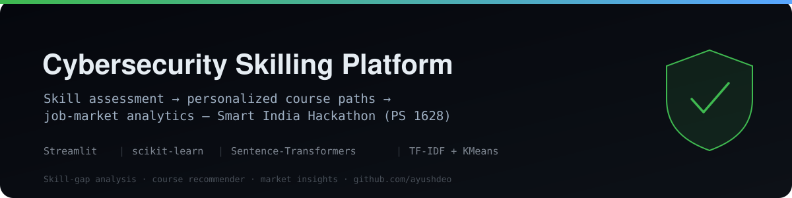
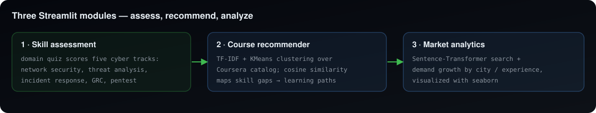

<p align="center">
  
</p>

<p align="center">
  
  
  
  
</p>

# Cybersecurity Skilling Platform — SIH 1628

> A **Smart India Hackathon** solution that guides someone into a cybersecurity career end-to-end: measure where their skills stand, recommend the exact courses to close the gaps, and show where the jobs actually are.

Built for problem statement **1628** — turning a skills-gap problem into a concrete, data-driven learning-and-hiring pipeline.

---

## 🧩 The three modules

<p align="center">
  
</p>

**1 · Skill assessment** (`questionnaire-app.py`, `SIH_Questionnaire_v2.py`)
An interactive quiz that scores a candidate across five cybersecurity tracks — network security, threat analysis, incident response, GRC, and penetration testing — to build a per-domain skill profile.

**2 · Course recommender** (`recc-app.py`)
Vectorizes a Coursera course catalog (`Name` + `Tags`) with **TF-IDF**, groups it with **K-Means**, and uses **cosine similarity** to recommend the courses that best fill a user's weakest domains.

**3 · Job-market analytics** (`dashboard-app.py`)
A Streamlit dashboard using a **Sentence-Transformer** (`paraphrase-MiniLM-L6-v2`) for semantic search, plus month-over-month demand growth by city and experience level, visualized with seaborn.

## 🗂️ Contents

```
├── questionnaire-app.py / SIH_Questionnaire_v2.py   # skill assessment (Streamlit + CLI)
├── recc-app.py                                       # TF-IDF + KMeans course recommender
├── dashboard-app.py                                  # market-analytics dashboard
├── coursera-course-detail-data.csv                   # course catalog
├── buckets_and_numbers.csv / page*_table.csv         # market demand data
└── tester.py                                         # helper / experiments
```

## ▶️ Run

```bash
pip install streamlit scikit-learn sentence-transformers pandas matplotlib seaborn
streamlit run recc-app.py        # course recommendations
streamlit run dashboard-app.py   # market analytics
python questionnaire-app.py      # skill assessment
```

## 🧰 Tech stack

`Streamlit` · `scikit-learn` (TF-IDF, K-Means, cosine similarity) · `sentence-transformers` · `pandas` · `matplotlib` / `seaborn`

---

<sub>Author: **Ayush Deo** · [github.com/ayushdeo](https://github.com/ayushdeo) · Applied ML · team hackathon project (SIH 2024)</sub>
